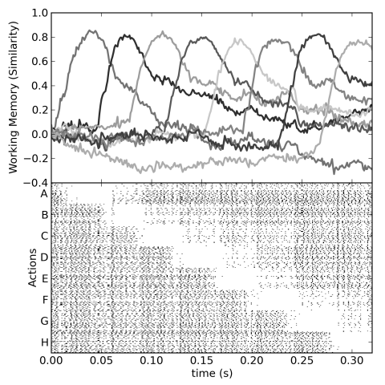
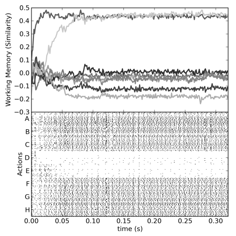
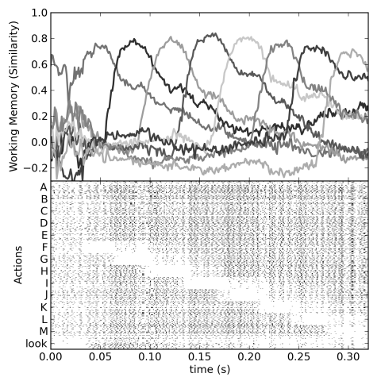

Cognitive control
=================

Three examples of sequences of actions controlled by the basal
ganglia. First, the model follows a fixed sequence A->B->C->D,
etc. Second, the model has a fixed routing of information from visual
to working memory. This interrupts the sequencing ability, trapping it
at the first value. Third, we use the thalamus to gate the flow of
information. This allows the sequence to be started based on a visual
cue, and then have that visual cue be ignored while going through the
sequence.

## Instructions

1. Start Nengo
2. Run the scripts for the three models:
   `sequence1.py`, `sequence2.py`, and `sequence3.py`
3. When run, the scripts will automatically run the models,
   producing `.csv` log files
4. To produce the graphs, you need Python and Matplotlib installed
5. Run the scripts `sequence1-plot.py`, `sequence2-plot.py`, and
   `sequence3-plot.py` to create the plots. Note that these are *not*
   to be run in Nengo. These are normal Python scripts.

## Figures

